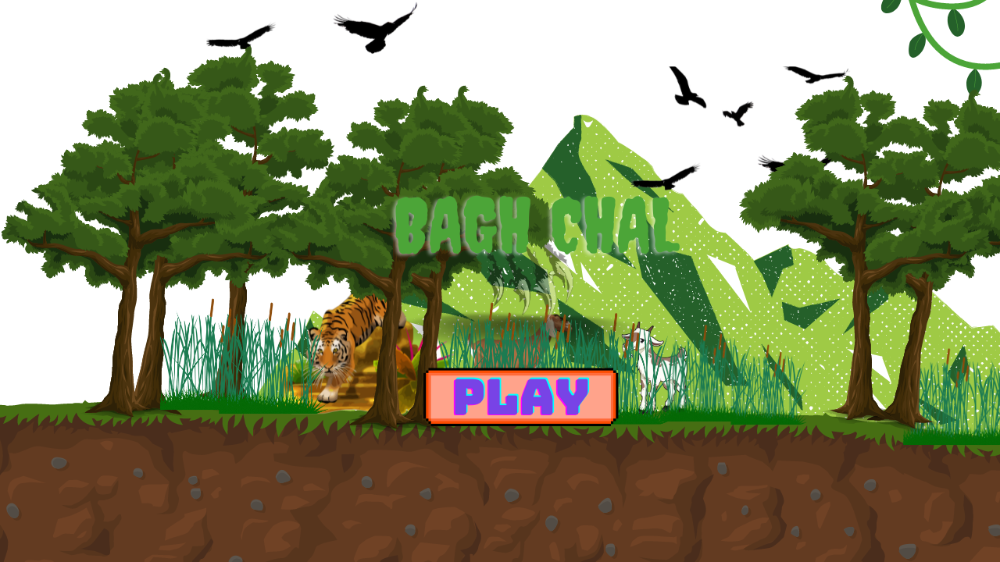
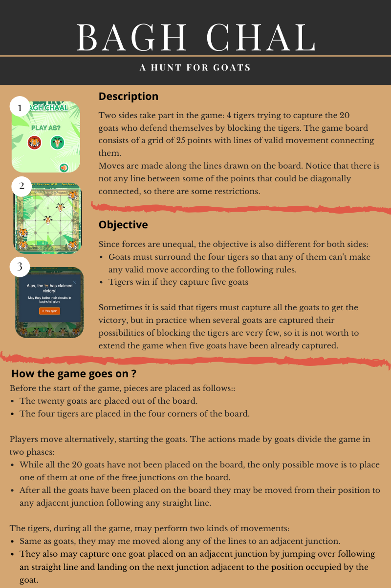
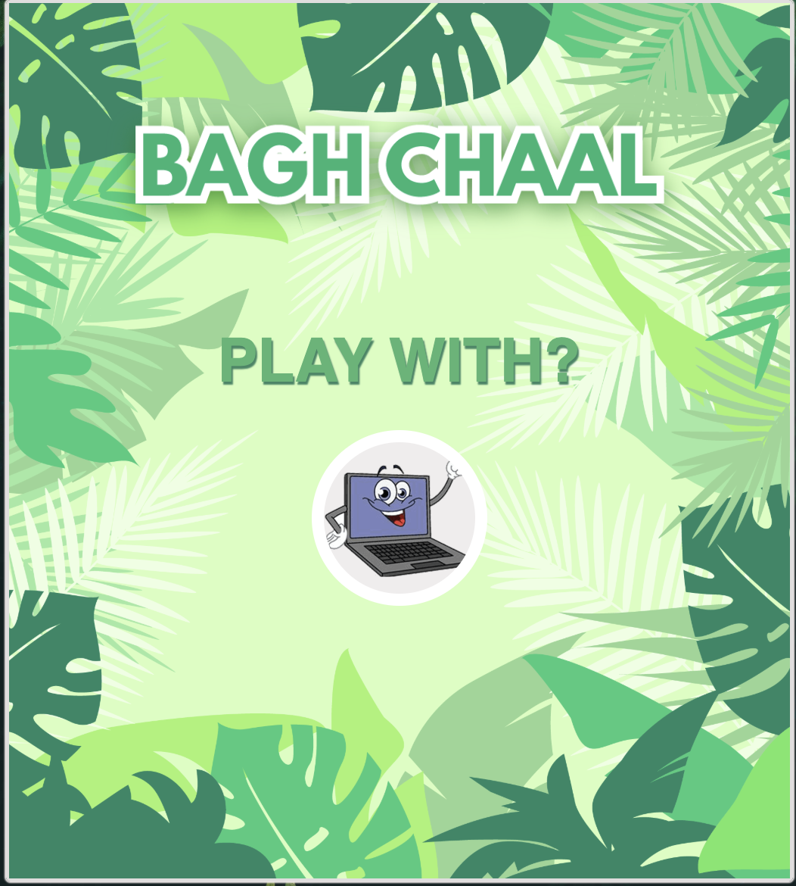
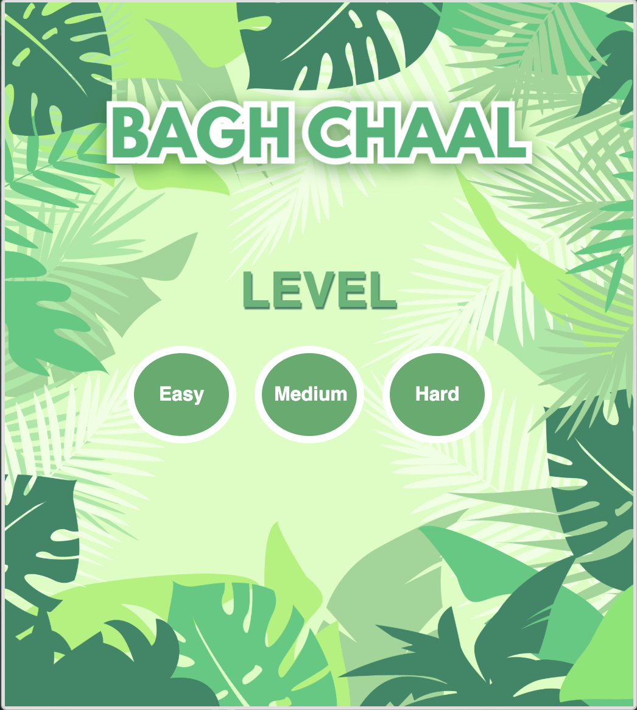
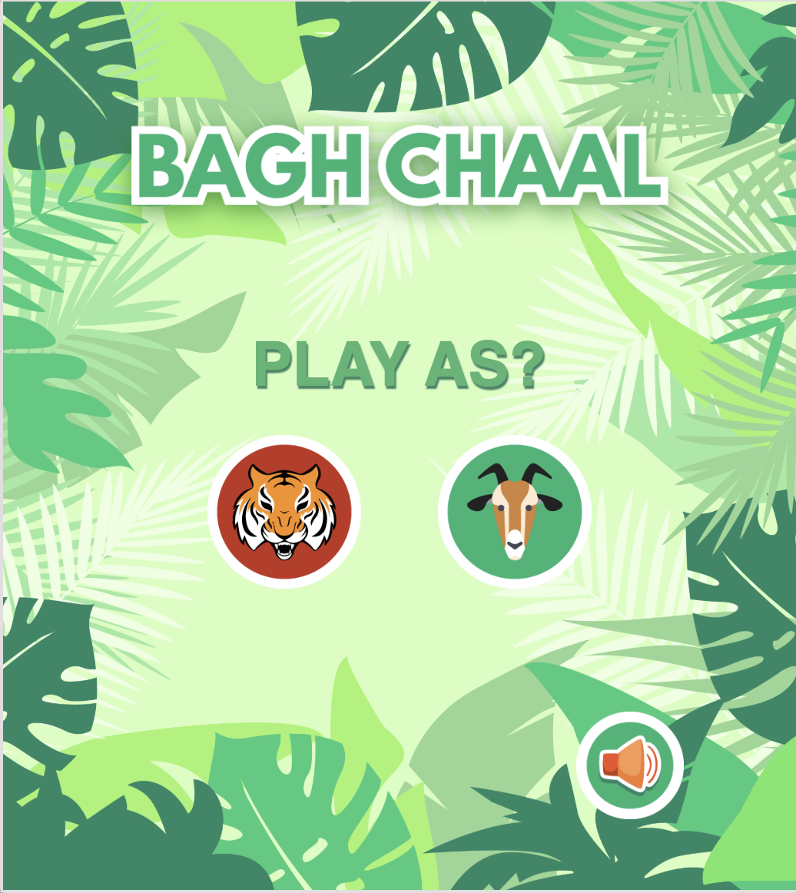
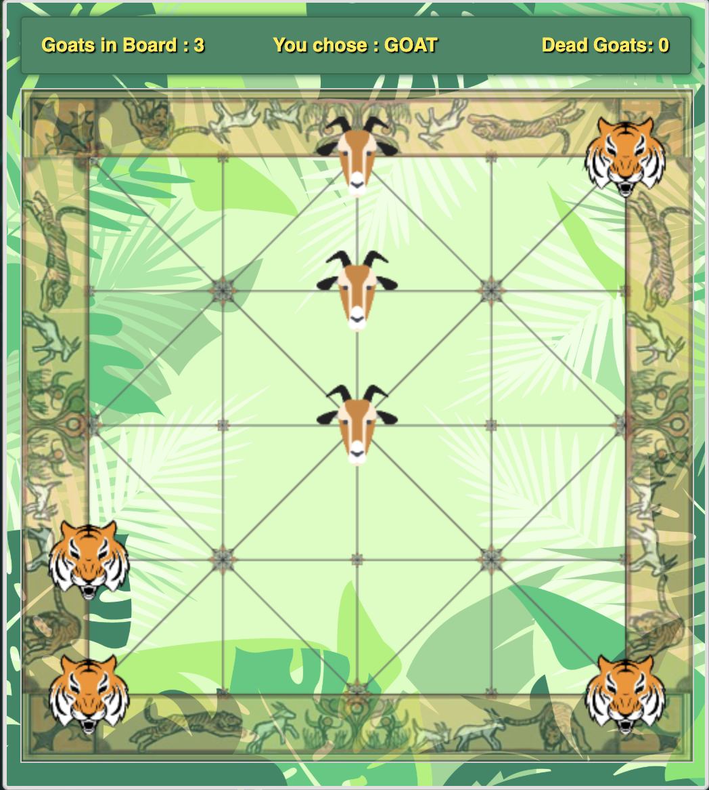
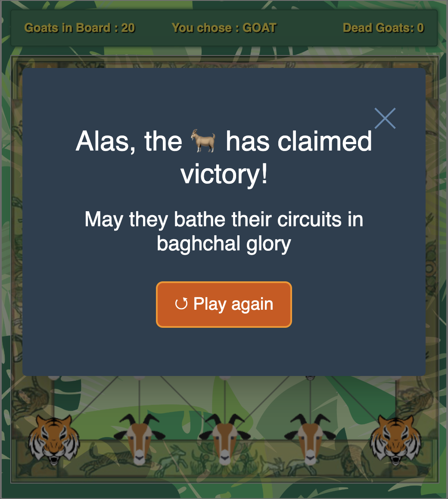
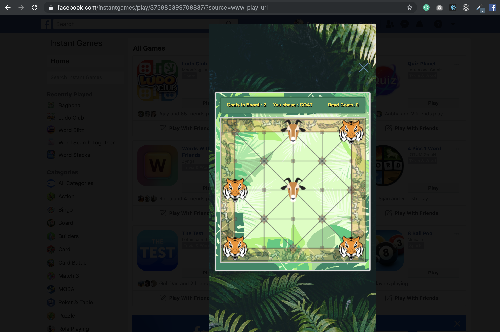

Bagchal: The Hunt for Goats
======

[](https://github.com/sumn2u/baghchal/issues) [](https://github.com/sumn2u/baghchal/network)
[](https://github.com/sumn2u/baghchal/stargazers)
[](https://github.com/sumn2u/baghchal/blob/master/LICENSE)
[](https://twitter.com/intent/tweet?text=Wow:&url=https%3A%2F%2Fgithub.com%2Fsumn2u%2Fbaghchal)


Bagh-Chal is a strategic, two-player board game that originated in Nepal. The game is asymmetric in that one player controls four tigers and the other player controls up to twenty goats. The tigers 'hunt' the goats while the goats attempt to block the tigers' movements. This game is also seen in southern India with a different board, but the rules are the same.

[](https://youtu.be/cyQjHWMCXNE)


This project was initally build for [Community Challenge hackathon](https://developercircles2019.devpost.com) by Facebook Developers Community and submitted as a [baghchal-nepali-board-game](https://devpost.com/software/baghchal-nepali-board-game).

## Jump To
* [Description](#description)
* [Installation](#installation)
* [Instructions](#instructions)
* [Demos](#demos)
* [Screenshots](#screenshots)
* [Tests](#tests)
* [Contributing](#contributing)
* [License](#license)

## Description

The game is asymmetric in that one player controls four tigers and the other player controls up to twenty goats. The tigers 'hunt' the goats while the goats attempt to block the tigers' movements. This game is also seen in southern India with a different board, but the rules are the same.


## Installation

Installing `bagh-chal` is easy.  You can clone the repo from here.

```
 git clone https://github.com/sumn2u/baghchal.git
```

... and run the following command

```
yarn install && yarn start
```

## Instructions


## Support the project ⭐

If you feel awesome and want to support us in a small way, please consider starring and sharing the repo! This helps us get visability and allow the community to grow. 🙏


## Demos

https://bagh-chal-dd292.firebaseapp.com/

For Facebook Instant Games:
https://fb.gg/play/375985399708837

## Screenshots








## Tests

To test the application run the following command

```javascript
yarn run development

```
And open the following url

https://www.facebook.com/embed/instantgames/375985399708837/player?game_url=https%3A%2F%2Flocalhost%3A5000

You can run test by using following commands

```javascript
yarn run test

```


## Contributing

Feel free to pull and contribute!  If you do, please make a separate branch on your Pull Request, rather than pushing your changes to the Master.  It would also be greatly appreciated if you ran the appropriate tests before submitting the request. Hope you enjoy playing this game 💜.


## License

 BSD-3-Clause license
